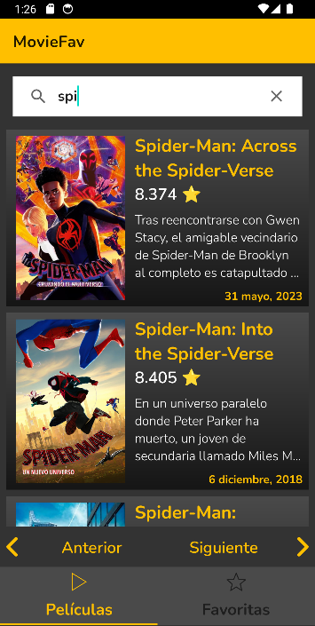

# MovieFav. Movie List Android Application

Mobile Application developed for a technical interview, using the Retrofit and Room libraries to read data from an API and to manage a local DB that allows data persistence.

  

